# ChunkyBrains Mobile Apps Portfolio

## Summary

At ChunkyBrains, we build mobile apps that are fast, reliable, and designed to deliver great user experiences. From startup ideas to enterprise solutions, we help businesses turn their vision into high-quality Android and Flutter applications that people love to use.

---

### Cross Platform Development

* Flutter
* Dart
* Firebase
* REST APIs
* Native Platform Channels

### Native Android Development

* Kotlin
* Java
* Jetpack Compose
* Android SDK
* Material Design


### Architecture & State Management

* Clean Architecture
* MVC / MVVM
* GetX
* Bloc
* Provider


### Advanced Integrations

* Real-Time Communication
* Location Services
* Camera & Media Processing
* Push Notifications
* Background Services
* Secure Local Storage
---
# Featured Applications
## 1. Out2Day  *(Flutter)*
A dynamic social discovery and networking platform that helps users connect with people sharing similar interests through location-aware matchmaking and real-time communication.
### Downloads
* Android: https://play.google.com/store/apps/details?id=com.app.out2day
* iOS: https://apps.apple.com/us/app/out2day-explore-with-friends/id6758880750
### Screenshots
<p align="center">


</p>
<p align="center">


</p>
---


## 2. Cartha AI  *(Flutter)*
AI-powered emotional wellness companion helping users navigate anxiety, relationships, self-growth, and mental wellbeing.

### Downloads
* Android: https://play.google.com/store/apps/details?id=com.cartha_ai_mobile
* iOS: https://apps.apple.com/us/app/cartha-ai/id6737981702


### Screenshots

<p align="center">


</p>
<p align="center">


</p>
---


## 3. ANRML  *(Flutter)*
Industrial CMMS platform for maintenance scheduling, asset tracking, KPI monitoring, and operational workflow optimization.

### Downloads
* Android: https://play.google.com/store/apps/details?id=com.anrml


### Screenshots
<p align="center">


</p>
<p align="center">


</p>
---


## 4. MenuBazaar  *(Flutter)*
A modern Digital QR Menu platform designed for restaurants and hospitality businesses. It enables dynamic contactless menu management, real-time price updates, and secure table-side catalog interactions commission-free.


### Downloads
* Android: https://play.google.com/store/apps/details?id=chunkybrains.menubazaar&pli=1


### Screenshots

<p align="center">
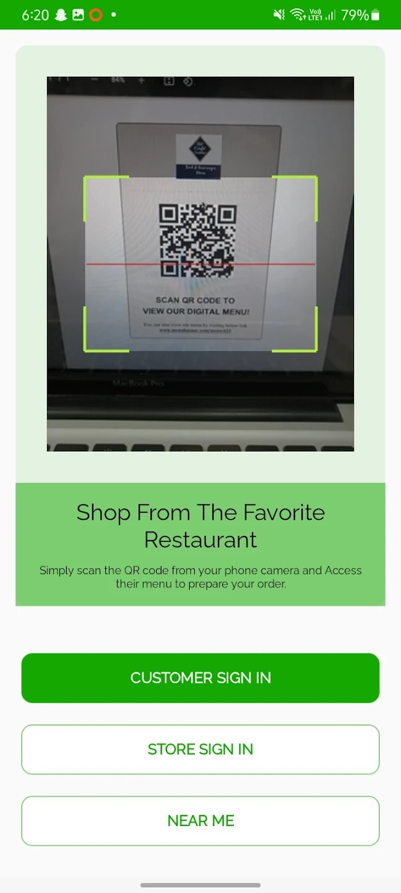
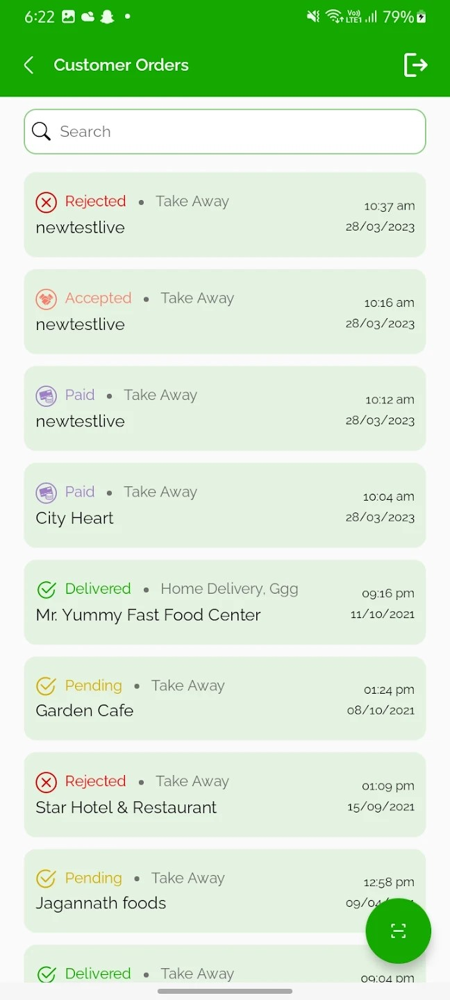
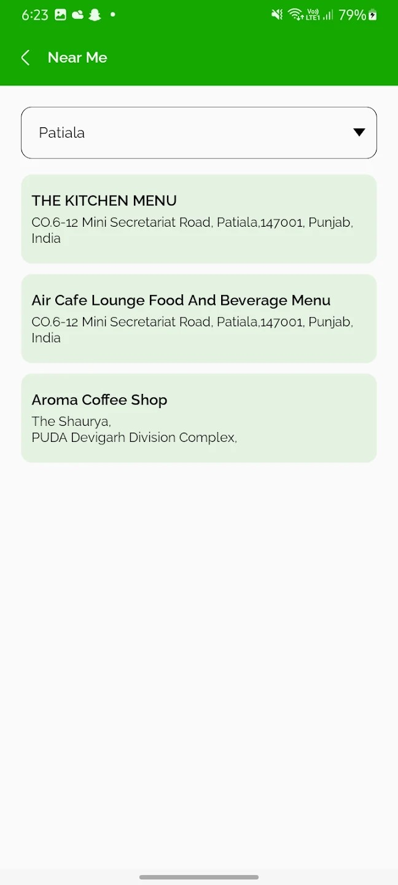
</p>
<p align="center">
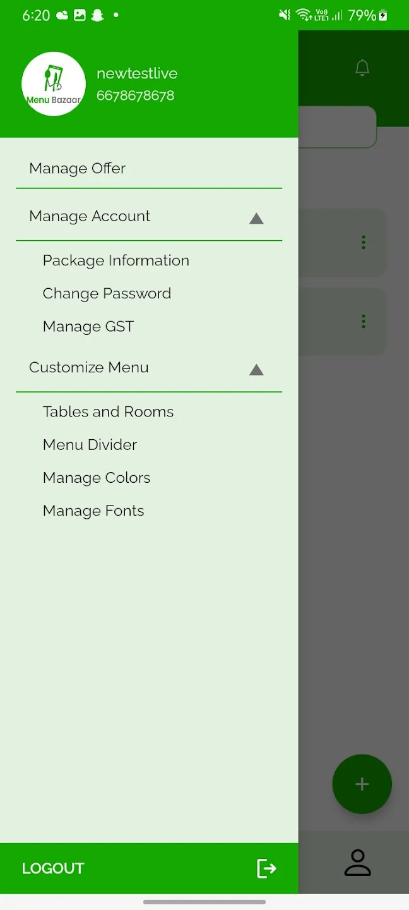
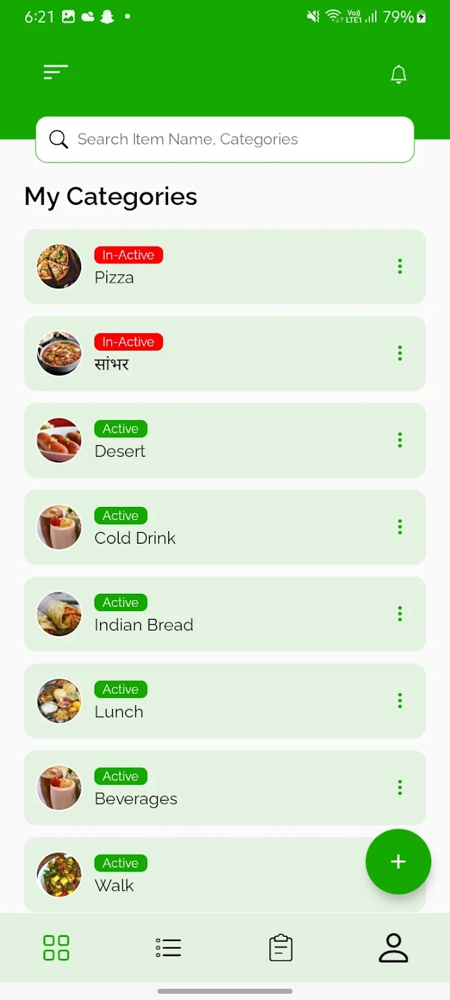
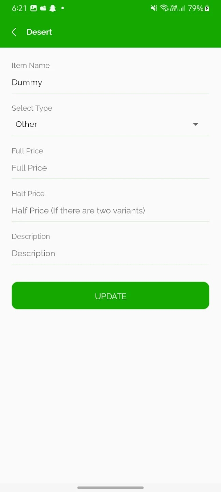
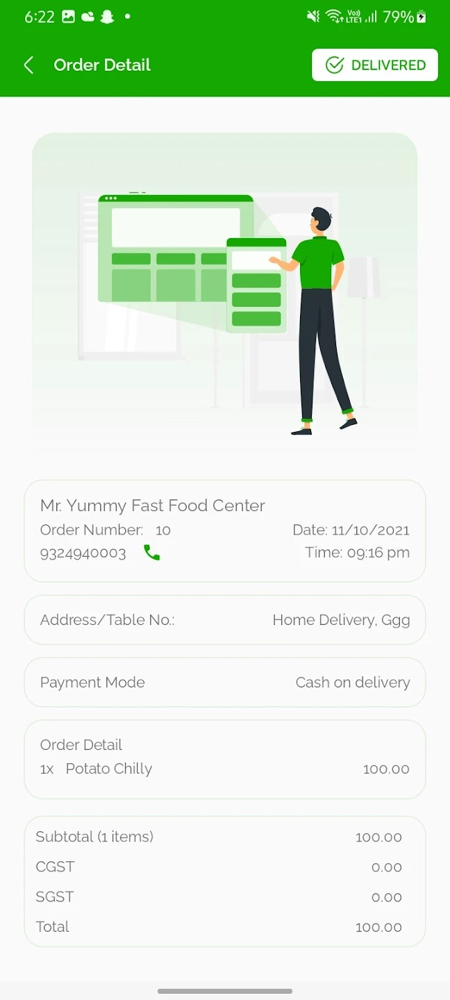
</p>
---


## 5. COCO  *(Flutter)*
Pet care ecosystem offering veterinary appointments, grooming services, nutrition management, and pet product delivery.


### Status
Ongoing Production Stage


### Screenshots

<p align="center">


</p>
<p align="center">


</p>
---


## 6. Wilson  *(Flutter)*
Enterprise-grade workforce management solution featuring attendance, leave workflows, task assignment, and location-based operations tracking.


### Status
 Enterprise Production


### Screenshots

<p align="center">
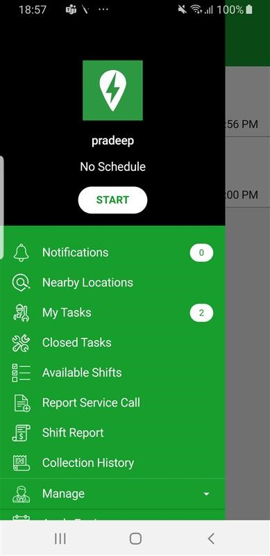
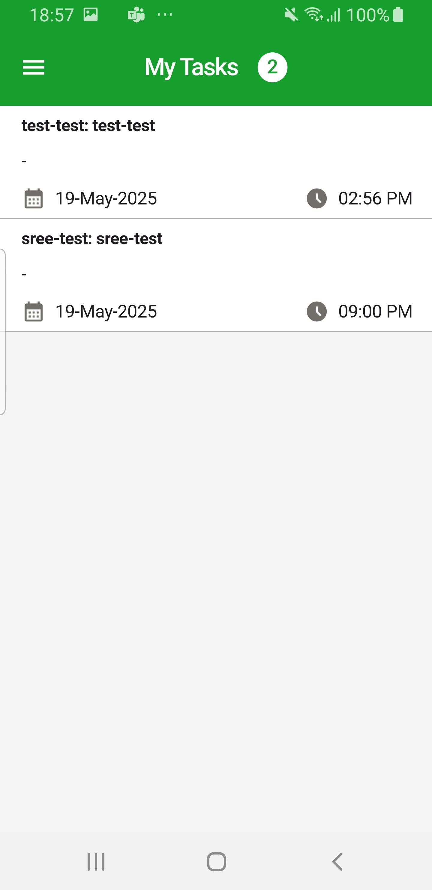
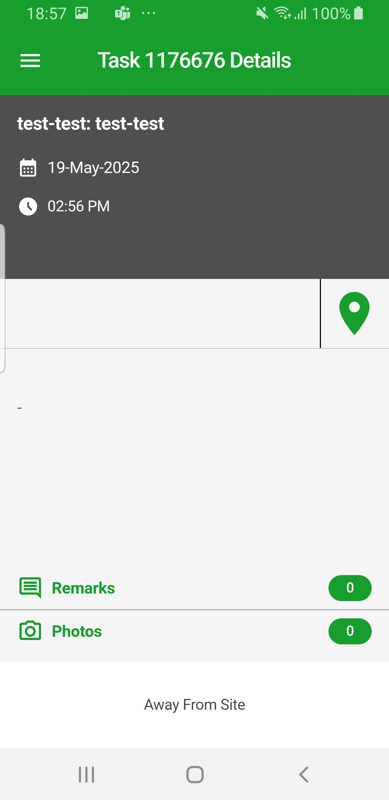
</p>
<p align="center">
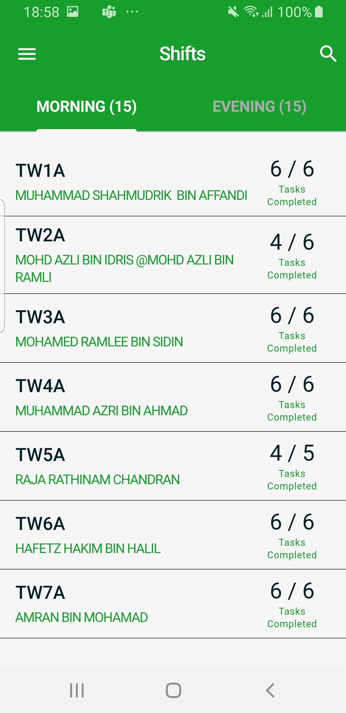
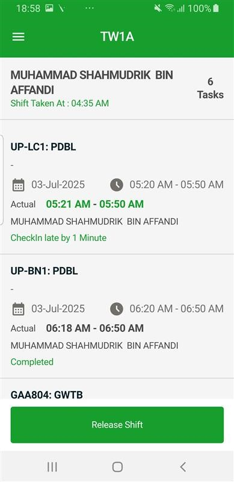
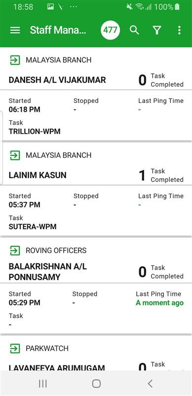
</p>
---


## 7. 211 Utah 🇺🇸 *(Native Android)*
Community assistance platform connecting users with housing, food, healthcare, and social support services throughout Utah.


### Downloads
* Android: https://play.google.com/store/apps/details?id=ncr.com.ncr
* iOS: https://apps.apple.com/us/app/211-utah/id1167593755


### Screenshots

<p align="center">


</p>
<p align="center">


</p>
---


## 8. Baghdad Home 🇮🇶 *(Native Android)*
Real estate marketplace helping users discover apartments, homes, and investment properties across Iraq.


### Downloads
* Android: https://play.google.com/store/apps/details?id=com.baghdadhomes


### Screenshots

<p align="center">
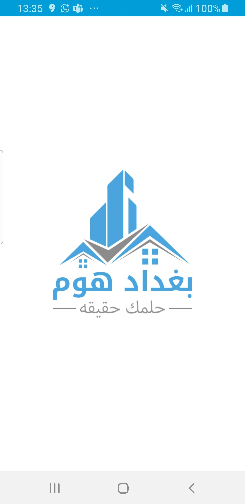
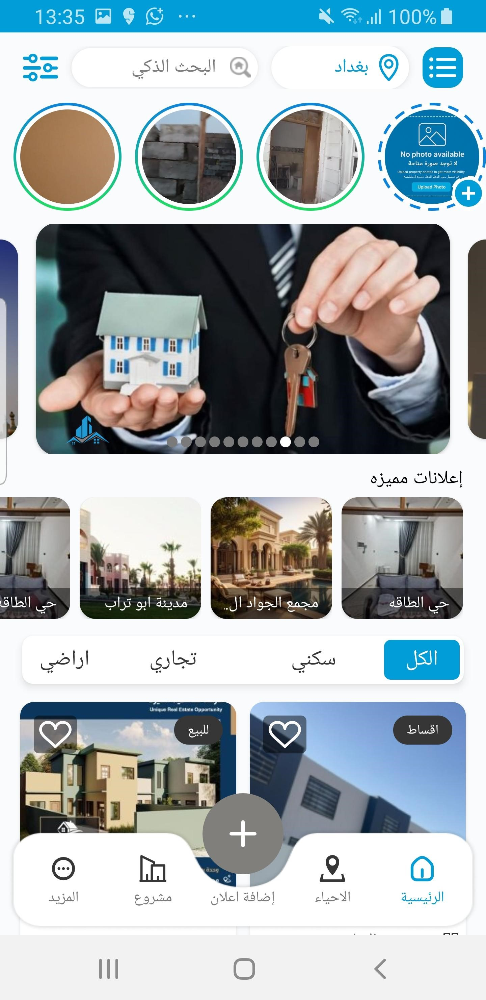
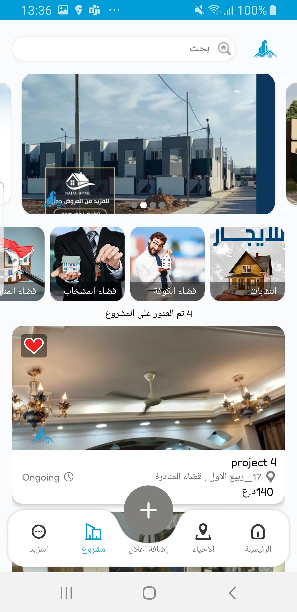
</p>
<p align="center">
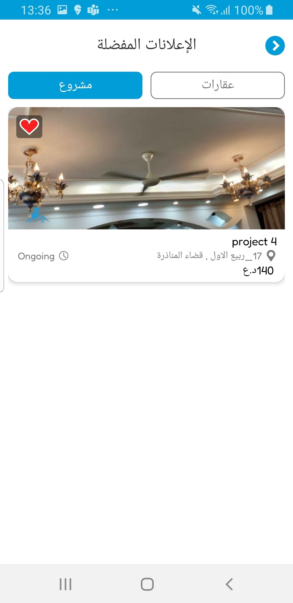
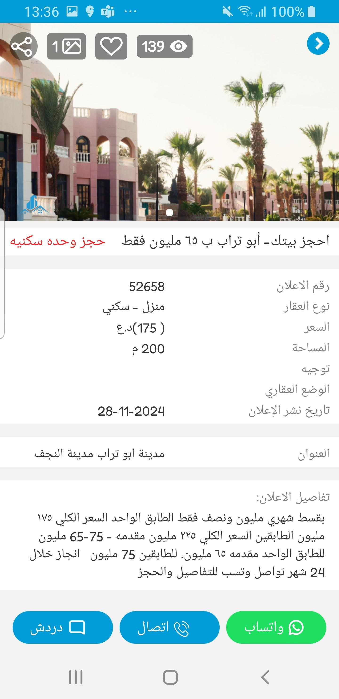
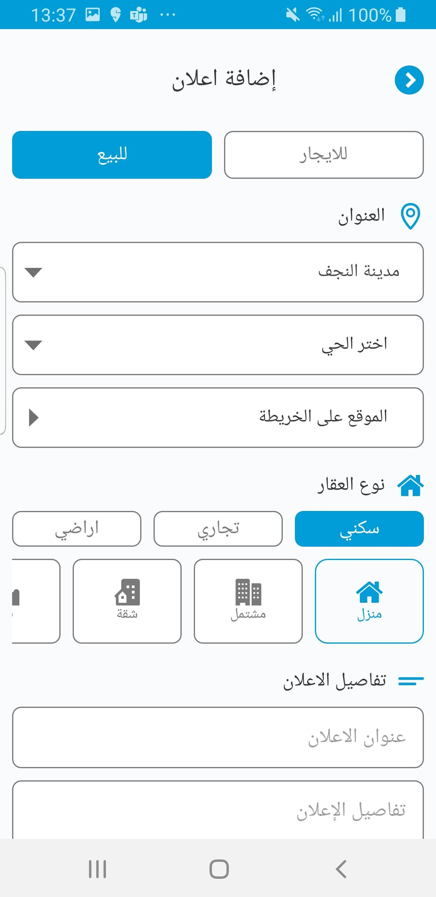
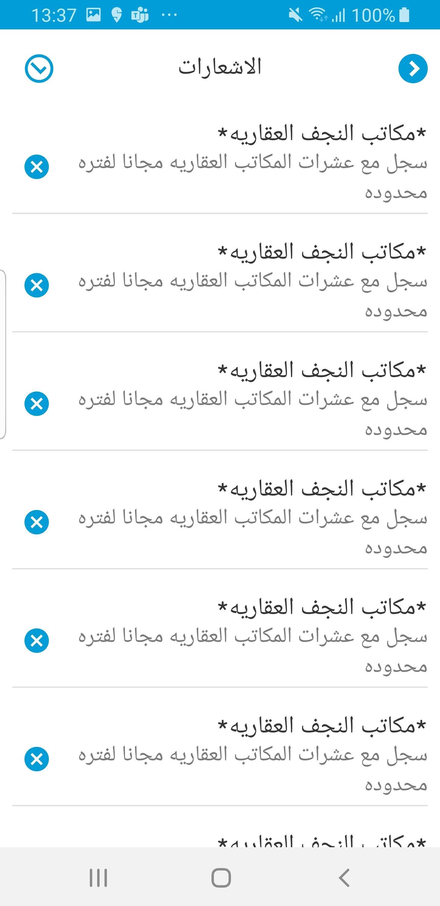
</p>
---


##  Engineering Standards
 
* Clean & Scalable Architecture
* Production Ready Codebases
* Responsive UI Across Devices
* High Performance Rendering
* Enterprise-Level Maintainability
* Security Focused Development
* Long-Term Product Scalability
 
---
 
##  Collaborate With Us


 Email: chunkybrains123@gmail.com

 Website: https://chunkybrains.com


##  Technical Architecture Blueprints (Code Preview)
We follow highly decoupled modular programming models across frameworks. Click on the toggles below to view our standard high-performance blueprints:
<details>
<summary><b> Click to View Our Flutter Clean Architecture Pattern (Dart)</b></summary>
<br>
 
```dart
// domain/usecases/get_user_profile_usecase.dart
abstract class UseCase<Type, Params> {
  Future<Either<Failure, Type>> call(Params params);
}
class GetUserProfileUseCase implements UseCase<UserEntity, String> {
  final UserRepository repository;
  GetUserProfileUseCase({required this.repository});
  @override
  Future<Either<Failure, UserEntity>> call(String userId) async {
    return await repository.getUserProfile(userId);
  }
}
 
// presentation/controllers/profile_controller.dart
class ProfileController extends GetxController with StateMixin<UserEntity> {
  final GetUserProfileUseCase _getUserProfile;
  ProfileController(this._getUserProfile);
  void fetchProfile(String userId) async {
    change(null, status: RxStatus.loading());
    final result = await _getUserProfile(userId);
    result.fold(
      (failure) => change(null, status: RxStatus.error(failure.message)),
      (user) => change(user, status: RxStatus.success()),
    );
  }
}

// data/repository/UserRepositoryImpl.kt
class UserRepositoryImpl(private val apiService: ApiService) : UserRepository {
    override suspend fun getUserData(userId: String): Resource<UserResponse> {
        return try {
            val response = apiService.fetchUserProfile(userId)
            if (response.isSuccessful) Resource.Success(response.body())
            else Resource.Error("Failed to fetch user data")
        } catch (e: Exception) {
            Resource.Error(e.localizedMessage ?: "An unexpected error occurred")
        }
    }
}
 
// presentation/profile/ProfileViewModel.kt
class ProfileViewModel(private val repository: UserRepository) : ViewModel() {
    private val _uiState = MutableStateFlow<UiState>(UiState.Loading)
    val uiState: StateFlow<UiState> = _uiState.asStateFlow()
 
    fun loadProfile(userId: String) {
        viewModelScope.launch {
            _uiState.value = UiState.Loading
            when (val result = repository.getUserData(userId)) {
                is Resource.Success -> _uiState.value = UiState.Success(result.data)
                is Resource.Error -> _uiState.value = UiState.Error(result.message)
            }
        }
    }
}
